# 🚗 AlAlSat – AI Destekli Araç Alım Satım Platformu

AlAlSat, kullanıcıların güvenli bir şekilde araç ilanı oluşturabildiği, diğer kullanıcılarla iletişim kurabildiği ve topluluk içerisinde etkileşim sağlayabildiği modern bir araç alım satım platformudur.

Proje yalnızca ilan paylaşımına odaklanmak yerine; sosyal ağ özellikleri, gerçek zamanlı mesajlaşma, forum sistemi ve yapay zekâ destekli araç asistanını tek bir platformda birleştirerek kapsamlı bir kullanıcı deneyimi sunmayı amaçlamaktadır.

## Kurulum Notu

Backend'i çalıştırmadan önce kök dizindeki [.env.example](.env.example) dosyasını [.env](.env) olarak kopyalayın ve değerleri doldurun. AI asistanının çalışması için özellikle `GEMINI_API_KEY` veya `GOOGLE_API_KEY` tanımlı olmalıdır; ardından backend'i yeniden başlatın.

---

# 📸 Ekran Görüntüleri

## Giriş - Kayıt - Doğrulama

<table align="center">
  <tr>
    <td align="center">
      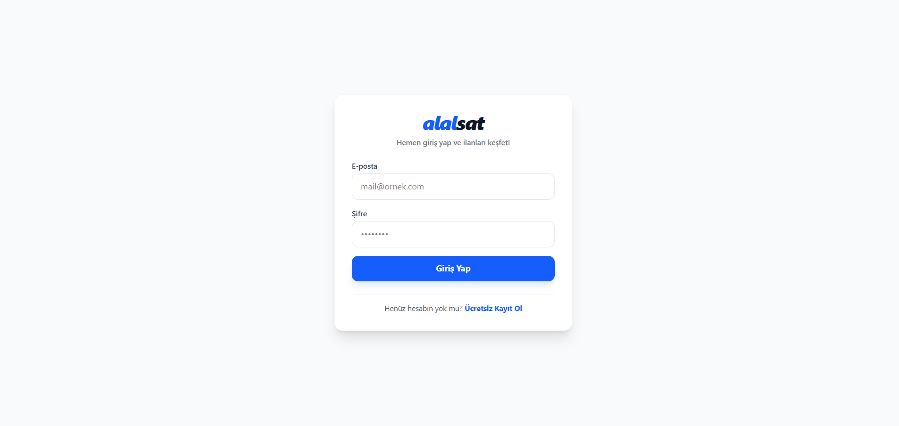 
      <b>Giriş</b>
    </td>
    <td align="center">
      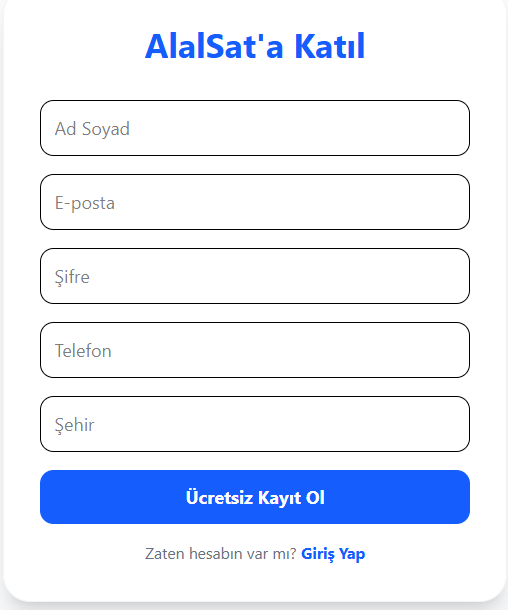 
      <b>Kayıt</b>
    </td>
    <td align="center">
      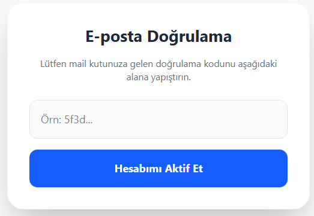 
      <b>Doğrulama</b>
    </td>
  </tr>
</table>

---

## Ana Sayfa

  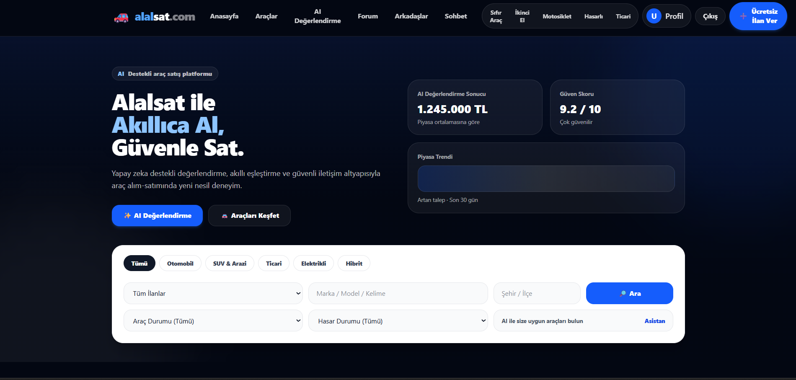

---

## Araç İlanı

<table align="center">
  <tr>
    <td align="center">
      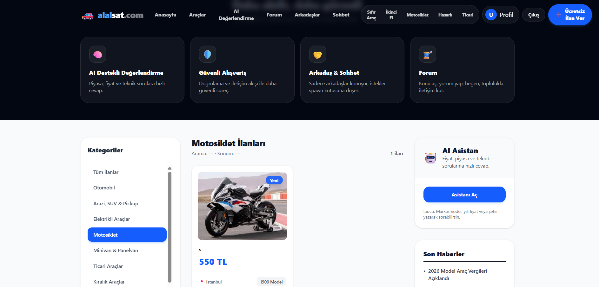 
      <b>İlanlar</b>
    </td>
    <td align="center">
      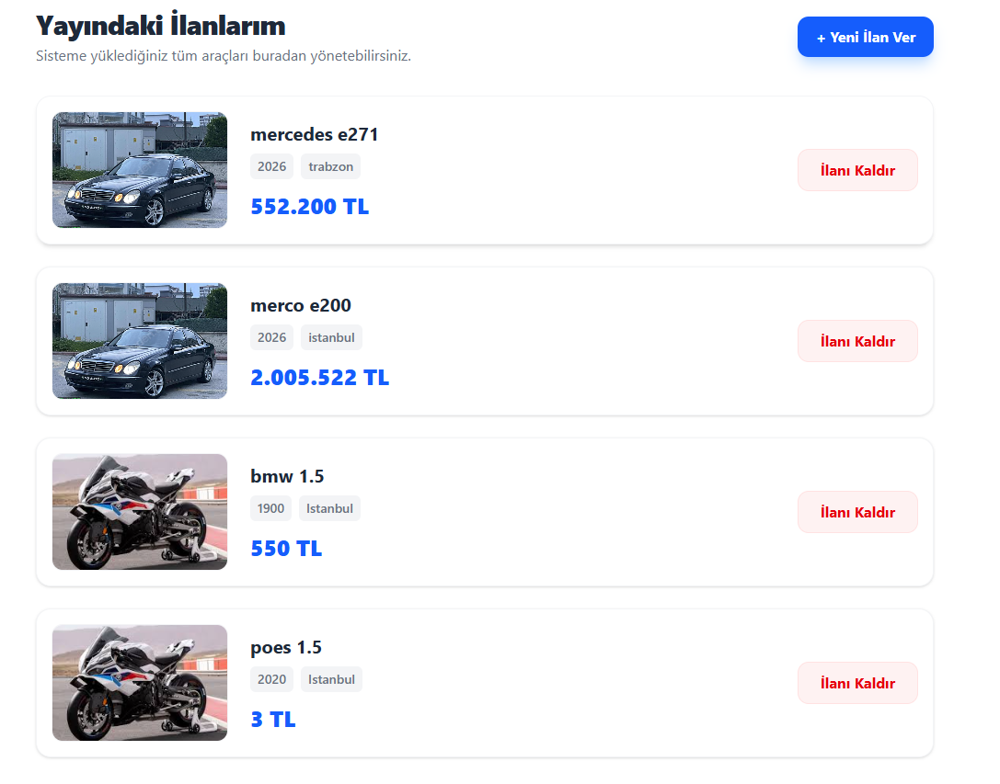 
      <b>İlanlarım</b>
    </td>
    <td align="center">
      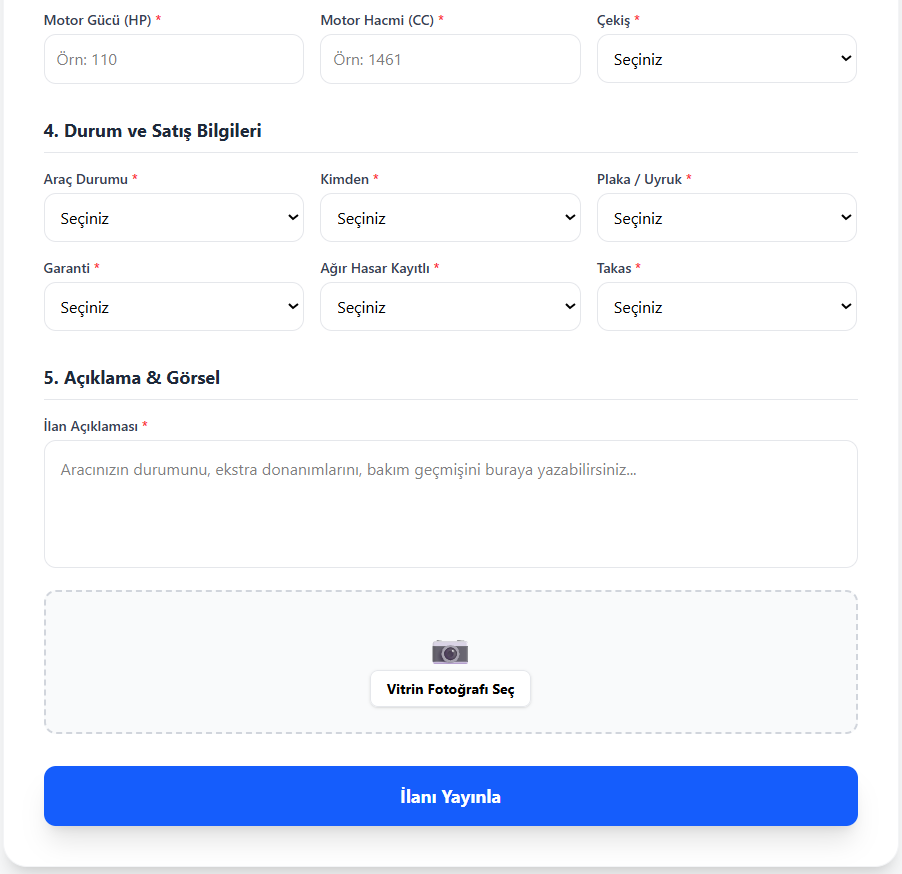 
      <b>İlan Ver</b>
    </td>
    <td align="center">
      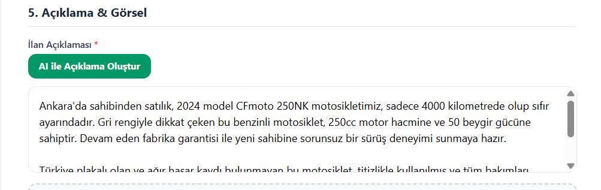 
      <b>AI Destekli İlan</b>
    </td>
  </tr>
</table>

---

---

## AI Asistanı

  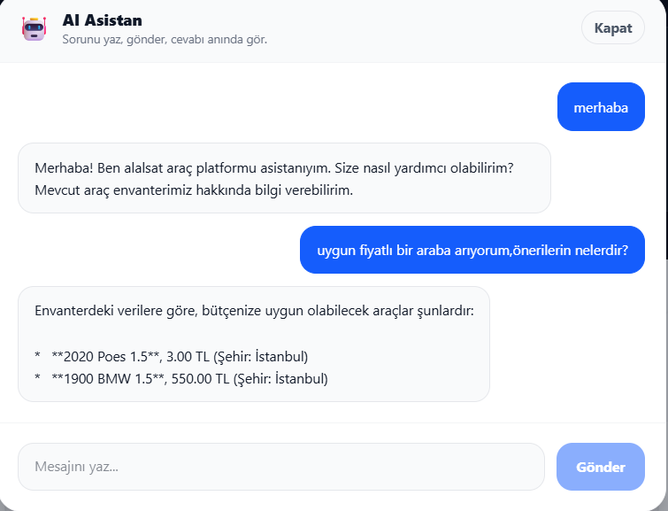

---

## Sohbet

  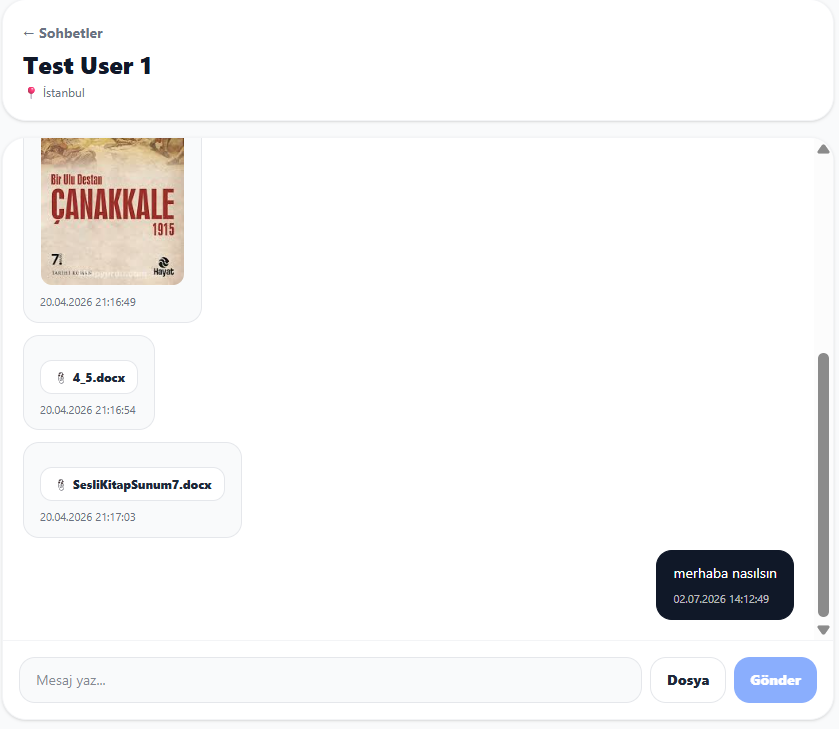

---

## Forum

  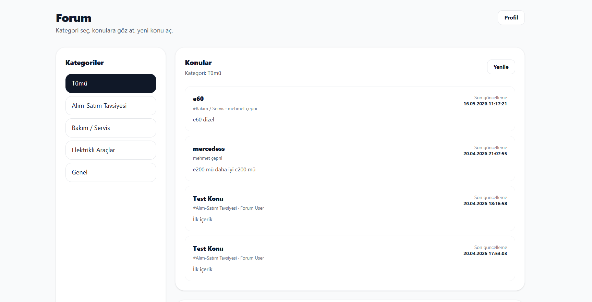

---

# ✨ Özellikler

## 👤 Kimlik Doğrulama ve Hesap Yönetimi

* Kullanıcı kayıt ve giriş sistemi
* JWT tabanlı güvenli kimlik doğrulama
* E-posta doğrulama
* Şifre sıfırlama akışı
* Hesap dondurma ve yeniden aktifleştirme
* Hesabı ve ilişkili verileri tamamen silme

---

## 🚗 Araç İlan Yönetimi

* Araç ilanı oluşturma
* Araç bilgilerini detaylı şekilde ekleme
* Çoklu araç görseli yükleme
* Tüm ilanları listeleme
* İlan detay sayfası
* Kullanıcının kendi ilanlarını yönetmesi ve silmesi

---

## 👥 Sosyal Özellikler

Platform kullanıcıları yalnızca ilan paylaşmakla kalmaz, aynı zamanda birbirleriyle sosyal etkileşim de kurabilir.

* Kullanıcı arama
* Arkadaşlık isteği gönderme
* Gelen ve giden istekleri görüntüleme
* İstek kabul etme, reddetme veya iptal etme
* Arkadaş listesini görüntüleme
* Arkadaş silme

---

## 💬 Gerçek Zamanlı Mesajlaşma

Kullanıcılar arkadaşlarıyla anlık olarak iletişim kurabilir.

* Direct Message (DM) sistemi
* Sohbet başlatma
* Konuşma geçmişi
* WebSocket ile gerçek zamanlı mesajlaşma
* Dosya eki gönderme
* Gelen kutusu (Inbox)

---

## 📝 Forum Sistemi

Topluluk etkileşimini artırmak amacıyla forum modülü geliştirilmiştir.

* Forum kategorileri
* Konu oluşturma
* Konuları listeleme
* Yorum yapma
* Yorum beğenme / beğeniyi kaldırma

---

## 🤖 AI Destekli Araç Asistanı

Platform içerisinde bulunan yapay zekâ asistanı, Gemini API kullanarak kullanıcı sorularını yanıtlar.

Asistan;

* Güncel araç ilanlarını analiz eder.
* Veritabanındaki envanteri bağlam olarak kullanır.
* Kullanıcıya kısa ve ilgili öneriler sunar.
* Araç arama sürecini kolaylaştırır.

---

# 🏗️ Sistem Mimarisi

## Backend

* FastAPI
* PostgreSQL
* JWT Authentication
* Passlib & Bcrypt
* WebSocket
* Dosya Yükleme
* SMTP Mail Servisi

## Frontend

* React
* Vite
* React Router
* Axios
* Tailwind CSS

## AI Entegrasyonu

* Gemini API

---

# 🛠️ Teknoloji Yığını

| Katman                  | Teknolojiler                                                                              |
| ----------------------- | ----------------------------------------------------------------------------------------- |
| Backend                 | FastAPI, Uvicorn, psycopg2, python-dotenv, passlib, bcrypt, python-jose, python-multipart |
| Frontend                | React, Vite, React Router, Axios, TailwindCSS                                             |
| Veritabanı              | PostgreSQL                                                                                |
| AI                      | Gemini API                                                                                |
| Gerçek Zamanlı İletişim | WebSocket                                                                                 |

---

# 🗄️ Veritabanı

Başlıca tablolar:

* users
* vehicles
* vehicle_images
* friend_requests
* friendships
* dm_conversations
* dm_participants
* dm_messages
* dm_attachments
* forum_categories
* forum_threads
* forum_posts
* forum_tags
* forum_thread_tags
* forum_post_likes
* chat_sessions
* chat_messages

# 🚀 Yol Haritası

* Rol tabanlı yetkilendirme
* Favoriler sistemi
* Bildirim merkezi
* Gelişmiş filtreleme
* Docker desteği
* CI/CD entegrasyonu

---

# 📄 Lisans

Bu proje eğitim ve geliştirme amacıyla hazırlanmıştır.
